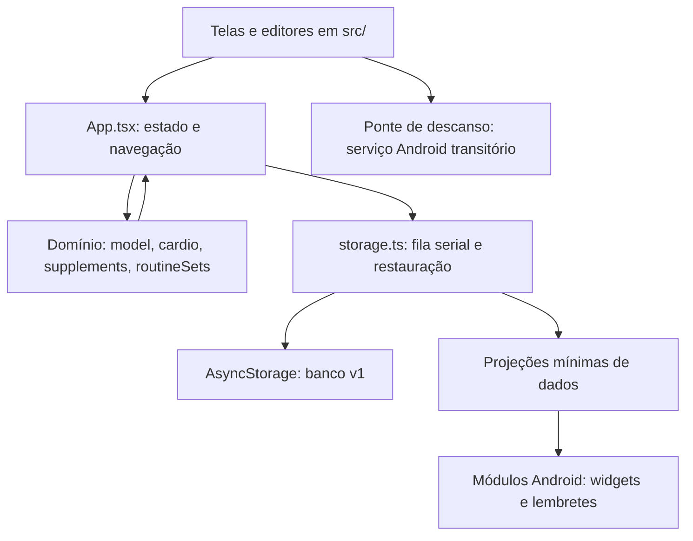

# Fundamentos do Ritmo

## Objetivo e decisões

Ajudar o usuário a chegar à academia com uma rotina definida e registrar o que realizou. A primeira versão privilegia manutenção simples, funcionamento offline e poucos passos para preencher cada série.

A implementação usa React Native com Expo e TypeScript. Android é a plataforma principal; a versão web facilita desenvolvimento e testes. O template também oferece comandos iOS, mas essa plataforma não foi validada.

O app tem interface em português brasileiro, não exige conta e não usa servidor. Os dados de Android e navegador são independentes. Há exportação e restauração manual de todo o banco em JSON; não há sincronização automática. Consulte [Backup e assinatura](BACKUP-E-ASSINATURA.md).

## Arquitetura

Caminhos relativos à raiz do repositório:

| Arquivo                    | Responsabilidade                                                                         |
| -------------------------- | ---------------------------------------------------------------------------------------- |
| `index.ts`                 | Registro do componente principal no Expo.                                                |
| `App.tsx`                  | Carregamento, estado da aplicação, navegação por estado React, persistência e diálogos.  |
| `src/model.ts`             | Tipos, rotinas/divisões, treinos, gráficos derivados, validação e leitura do banco.      |
| `src/cardio.ts`            | Rotinas de cardio, validação e cálculo da etapa atual pelo tempo real.                   |
| `src/CardioScreens.tsx`    | Editor e painel de velocidade do modo cardio.                                            |
| `src/bulkImport.ts`        | Gramática, validação e importação atômica de planejamento gerado por texto.              |
| `src/BulkImportScreen.tsx` | Entrada de JSON, explicação da gramática, cópia das instruções e prévia antes de salvar. |
| `src/storage.ts`           | AsyncStorage e fila serial de gravações.                                                 |
| `src/screens.tsx`          | Cartões e telas de edição, execução e detalhe dos treinos.                               |
| `src/ui.tsx`               | Componentes reutilizáveis e estilos.                                                     |
| `src/theme.ts`             | Paleta visual.                                                                           |
| `app.json`                 | Nome, identificador, recursos e configuração nativa.                                     |
| `tests/`                   | Regras de domínio, fluxos web e roteiro nativo.                                          |
| `scripts/serve-web.mjs`    | Servidor local do bundle web para testes de produção.                                    |

Não há biblioteca de estado global nem roteador externo. As regras de domínio não dependem da interface. Prefira estender essas separações antes de adicionar novas camadas.

A importação por texto aceita o contrato JSON versionado `ritmo/1`, documentado em `docs/IMPORTACAO.md`. Ela cria novas rotinas de força, divisões e cardios, valida o lote inteiro antes de gravar e preserva sessões ativas e histórico. Não há mudança na versão do banco ou em registros já salvos.

## Modelo de dados

A estrutura persistida `Database` tem `version: 1`, `routines`, `workouts` e `active` (um treino ou `null`). Conjuntos, pausa da força e suplementos também são opcionais; o esquema completo está em [Dados](DADOS.md). Os campos opcionais `cardioRoutines`, `activeCardio` e `cardioHistory` guardam o planejamento, a execução e as sessões concluídas de cardio sem alterar os dados antigos.

- `Routine`: identificador, nome, observação, exercícios, data de atualização e dias da semana opcionais (`weekdays`).
- `PlannedExercise`: identificador, nome e lista `reps`. O comprimento da lista é o número de séries, e cada posição contém a meta daquela série.
- `Workout`: identificador, referência à rotina, cópia do nome e dos exercícios, início, término opcional e peso corporal opcional (`bodyWeight`, string em kg).
- `LoggedSet`: identificador, meta original (`target`), repetições realizadas, carga e marcador `done`.

Valores de campos numéricos são strings durante a edição para permitir rascunhos e vírgula decimal. Converta e valide no domínio; não use conversão permissiva que transforme campo vazio em uma carga válida.

## Regras a preservar

1. Uma rotina salva exige nome, pelo menos um exercício nomeado e entre 1 e 20 séries por exercício.
2. Repetições válidas são inteiros de 1 a 999. Cada série tem sua própria meta.
3. Carga válida vai de 0 a 9.999 kg. Vírgula e ponto são aceitos como separador decimal, sem separadores de milhares. Campo vazio é inválido; 0 é um valor explícito para exercícios sem carga externa.
4. Ao iniciar, copie o planejamento para o treino. Não derive registros históricos da rotina atual. Editar ou excluir uma rotina não modifica sessões anteriores ou o treino já iniciado. Preencha a carga usando a sessão finalizada mais recente da mesma rotina (por `finishedAt`), associando exercícios pelo identificador e séries pela posição. Copie somente cargas válidas de séries concluídas, incluindo 0 kg. Séries novas ou não concluídas ficam vazias, sem buscar sessões mais antigas. Mantenha as repetições planejadas e todas as séries inicialmente desmarcadas. Retomar um treino ativo preserva seus valores.
5. Só pode existir um treino ativo. Tentar iniciar outro direciona ao treino em andamento.
6. Uma série só é concluída após confirmação e validação. Editar repetições ou carga desmarca sua conclusão.
7. Finalização exige ao menos uma série concluída. Treinos parciais são permitidos com confirmação; as demais séries ficam como não realizadas.
8. Finalizar move a sessão para o início do histórico, define `finishedAt` e limpa `active`.
9. Volume é a soma de repetições × carga apenas das séries concluídas. Tempo é o intervalo entre início e término, incluindo pausas e app fechado, arredondado em minutos com mínimo de 1.
10. Exclusões, descarte de treino e saída do editor com alterações não salvas têm diálogos de confirmação.

## Persistência e recuperação

A chave do AsyncStorage é `@ritmo/database/v1`. Todo o estado é salvo como um único JSON. As gravações são serializadas em `src/storage.ts` para impedir que uma versão antiga sobrescreva uma mais nova. A entrada única tem teto de 1.500.000 bytes UTF-8. Durante a restauração, a interface suspende mutações e autosave; o armazenamento espera a fila, relê a escrita e tenta repor o valor anterior em falha.

`App.tsx` mantém uma referência ao estado atual e um contador de revisão para lidar com o resultado das gravações. Alterações de um treino iniciado disparam persistência; ao passar para segundo plano, o estado também é gravado. Essa operação é assíncrona: não prometa garantia absoluta contra desligamento durante uma gravação.

Rotinas em edição são rascunhos locais à tela e só são persistidas em **Salvar rotina**. Erros de leitura preservam o conteúdo salvo e oferecem nova tentativa; erros de gravação aparecem em um aviso com opção de tentar novamente.

Se alterar o esquema ou a chave, mantenha a leitura dos dados anteriores ou implemente migração com testes. Nunca use limpeza automática como tratamento genérico de erro.

## Interface

Preserve a paleta clara com verde escuro e destaque verde-lima, textos curtos em português e alvos de toque adequados ao celular. Use SafeArea e respeite teclado e botão Voltar do Android. Campos e ações têm nomes acessíveis. Checkboxes e abas usam estados acessíveis nativos e atributos `aria-checked`/`aria-selected` para a versão web.
Durante a execução, `WorkoutScreen` mostra um exercício por vez, com contador de posição e botões Anterior/Próximo. A navegação é livre e não conclui séries automaticamente; o progresso e a finalização continuam referentes ao treino inteiro. Os valores permanecem no estado persistido do treino ao trocar de exercício. A posição da tela é apenas estado local: ao reabrir o treino, o primeiro exercício é exibido. Cadastro de rotina e detalhe do histórico continuam listando todos os exercícios.

### Histórico de carga durante o treino

Quando o exercício exibido tem ao menos uma série concluída no histórico da mesma rotina, o card de progresso é substituído pelo gráfico de `src/LoadHistoryChart.tsx`. Cada ponto do gráfico de linhas mostra a maior carga válida entre as séries concluídas daquele exercício em uma sessão finalizada; 0 kg é válido e séries pendentes não entram no cálculo. A consulta `exerciseLoadHistory` em `src/model.ts` associa rotina e exercício pelos IDs e não modifica os registros.

O eixo horizontal é categórico: sessões ordenadas por `finishedAt`, com pontos igualmente espaçados, independentemente do intervalo entre datas. Duas sessões na mesma data permanecem separadas. As etiquetas incluem dia/mês e ano; o nome acessível também inclui horário e carga. O histórico pode ser deslizado horizontalmente e abre nos registros mais recentes. Sem histórico do exercício, o card de progresso original permanece. O gráfico usa componentes nativos, sem dependência de biblioteca de gráficos e sem mudança no esquema persistido.

O gráfico também sobrepõe uma linha roxa tracejada com as repetições realizadas na série mais pesada, usando a mesma escala numérica vertical da carga e as mesmas posições de data. O limite superior considera ambas as grandezas. Em empate de carga, a série concluída com mais repetições é escolhida. Carga e repetições vêm sempre da mesma série válida; metas, séries pendentes e repetições de séries mais leves não entram nesse ponto. A legenda distingue carga (kg) e repetições. Marcadores e etiquetas permanecem visíveis quando há apenas um registro. `ExerciseLoadRecord` é um resultado derivado com `weight` e `reps`, sem alteração da estrutura persistida.

### Peso corporal na finalização

Após tocar em Finalizar treino com ao menos uma série concluída, a rota `finish` exibe `FinishWorkoutScreen`: peso corporal opcional e confirmação do salvamento, com aviso de séries pendentes quando necessário. O campo inicia com o último `bodyWeight` válido entre todas as sessões finalizadas, por `finishedAt`, independentemente da rotina. Sessões sem peso não apagam a sugestão anterior. Sem peso registrado, inicia vazio. O usuário pode alterar ou apagar o valor; vazio significa salvar somente o treino.

`finishWorkout` valida e salva o peso junto da sessão, e `WorkoutDetail` o exibe quando informado. São aceitos vírgula ou ponto decimal e valores maiores que 0 até 999 kg. O campo só é persistido ao confirmar Salvar treino; voltar ou reabrir a etapa descarta a edição e busca novamente o último peso salvo. Voltar do Android retorna ao treino. O treino ativo permanece salvo até a confirmação final.

O campo opcional é compatível com `Database.version: 1`: registros antigos sem `bodyWeight` continuam válidos, sem limpeza ou migração destrutiva. O parser valida o campo quando presente. Não confundir peso corporal com carga de séries ou volume de treino.

### Gráfico de peso na tela inicial

A tela Início exibe `BodyWeightChart`, abaixo dos resumos de treinos. A consulta `bodyWeightHistory` reúne somente pesos corporais válidos de sessões finalizadas, em todas as rotinas, ordenados por `finishedAt`. Treinos sem peso não criam pontos nem recebem valores estimados; sessões na mesma data permanecem separadas. Excluir um treino remove seu ponto automaticamente.

O gráfico reutiliza o desenho de linhas em `src/LoadHistoryChart.tsx`, com datas equidistantes e rolagem horizontal para históricos extensos. O card mostra o último peso registrado, marcadores com valores e datas com ano. Para evidenciar pequenas variações, o eixo vertical se ajusta ao intervalo dos pesos, com margem e limites numéricos explícitos; ele não precisa começar em zero. Um único registro aparece como ponto. Sem pesos, o card orienta a registrá-los na finalização. Sem novos campos persistidos ou dependências.

### Programação semanal das rotinas

O editor permite selecionar um ou mais dias da semana ou deixar a rotina sem dia definido. `Routine.weekdays?: number[]` usa os valores de `Date.getDay()` (0 = domingo, 6 = sábado), sem duplicatas. A interface apresenta os dias de segunda a domingo. O campo opcional preserva a leitura dos dados v1 antigos; ausência e lista vazia significam rotina livre. Alterações só persistem ao salvar a rotina e não reescrevem histórico ou treino ativo.

Os cards das rotinas mostram os dias escolhidos. Se houver alguma rotina programada, a tela Início mostra Treinos de hoje, com todas as rotinas atribuídas ao dia local do aparelho e ações para iniciá-las. Várias rotinas podem compartilhar um dia, e a mesma rotina pode ocupar vários dias. Dias sem rotina exibem uma mensagem. A data é atualizada ao retornar ao app e a cada minuto. A programação não bloqueia iniciar rotinas em outros dias nem substitui um treino em andamento. A programação não dispara notificações. O widget usa apenas atualização interna, conforme descrito abaixo.

### Widget de treinos no Android

O widget da tela inicial do Android mostra carinha triste enquanto há rotinas de hoje pendentes, feliz quando todas estão feitas e tranquila num dia sem treino. Sem dias configurados, orienta configurar a programação. Mostra nomes e contagem; tocar nele abre o aplicativo. O botão Adicionar widget no fim da tela Início abre a confirmação do launcher; também é possível adicioná-lo pela lista de widgets do Android.

A confirmação é a sessão finalizada e salva, inclusive parcial, da mesma rotina, com data local de `finishedAt` igual a hoje. Marcar séries de um treino ainda ativo não basta. Várias sessões da mesma rotina contam uma vez. O cálculo considera o calendário/fuso atual do aparelho, não apenas o dia da semana: uma sessão da segunda anterior não confirma a próxima segunda. Excluir um registro ou editar a programação recalcula o widget.

`src/widgetSnapshot.ts` deriva apenas IDs, nomes, dias e horários de conclusão das rotinas programadas. `src/widget.ts` oferece a ponte opcional para o módulo Expo local `modules/ritmo-widget/`. O módulo Android Kotlin desenha RemoteViews usando vetores e guarda essa projeção em SharedPreferences privadas. O banco v1 permanece inalterado e é a fonte de verdade. A sincronização ocorre depois de cada gravação bem-sucedida, dentro da mesma fila serial, e ao carregar o banco. Não há cópia de peso corporal, cargas ou séries no widget.

A descoberta do módulo é automática; manifesto, Kotlin e recursos ficam versionados no módulo, fora de `android/` gerado. Não há nova dependência de produção. Expo Go, web e iOS continuam usando o app sem o widget nativo. Para testar o widget é obrigatório compilar e instalar o APK.

O widget recalcula o dia sem JavaScript aberto: atualização periódica configurada para 30 minutos, eventos de reinício/hora/fuso/atualização do APK e alarme não exato na virada do dia. O sistema pode adiar essas atualizações em economia de energia. Não há notificações, alarme exato nem serviço permanente. Forçar parada nas configurações pode desativar o widget até reabrir o aplicativo, conforme comportamento do Android. Consulte `modules/ritmo-widget/README.md` para estrutura e roteiro nativo.

### Suplementos diários, sequência e lembretes

`Database.supplements?: Supplement[]` acrescenta hábitos diários ao banco v1. Ausência equivale a lista vazia, preservando rotinas, histórico e sessão ativa de versões anteriores. Cada suplemento tem `id`, `name`, `note`, `createdAt`, `takenOn: string[]` e `reminderTime?: string` em HH:mm. O parser valida datas reais, unicidade de registros diários e IDs, nomes e horários; conteúdo inválido continua sendo preservado com erro de leitura.

A aba Suplementos permite cadastrar/editar/excluir, registrar Tomei hoje e desfazer a marcação. Excluir avisa que remove também registros e lembrete. Alterar nome/observação/horário preserva os dias registrados. O resumo da tela Início aponta para a lista. A sequência é individual: dias consecutivos até hoje, ou até ontem enquanto hoje estiver em aberto; um dia inteiro sem registro reinicia a contagem. Os sete dias recentes são exibidos. Registros usam datas locais YYYY-MM-DD, sem converter os dias passados ao mudar de fuso, sem marcação retroativa e sem múltiplas doses no mesmo dia.

Cada suplemento pode ter sua própria notificação diária. A permissão do Android só é solicitada ao salvar com lembrete ativado; negá-la mantém o rascunho para permitir corrigir a permissão ou salvar sem aviso. Permissões revogadas depois são indicadas na lista, mantendo os horários salvos. Não há orientação automática sobre escolha de suplementos ou doses.

O módulo Expo local `modules/ritmo-reminders/` implementa notificações e widget, sem biblioteca extra de produção. Projeções mínimas são sincronizadas após a gravação serial em `src/storage.ts` e ao carregar o banco. Alarmes Android não exatos usam horário local e identificador próprio por suplemento; confirmar hoje desloca o próximo aviso para amanhã e remove a notificação visível. Desativar/excluir cancela o alarme. O receiver confere o cache antes de avisar, evita duplicidade por dia e rearma a próxima ocorrência mesmo sem JavaScript aberto. Reinício, alteração de hora/fuso e atualização do APK refazem a agenda. Economia de bateria e forçar parada podem adiar ou impedir avisos; não há promessa de precisão de despertador.

O widget Ritmo · Suplementos mostra a contagem diária, até três nomes com sequência e atalho para os demais, priorizando pendentes. Mostra Tudo em dia quando todos estão confirmados, incluindo suplementos sem notificação. Tocar no widget ou na notificação abre `ritmo://suplementos`; a confirmação é feita dentro do app. A abertura por link preserva editores e a etapa de finalização já abertos, exibindo uma orientação nesses casos. Widgets e notificações são exclusivos do APK Android; na web e no Expo Go, cadastro e sequências continuam disponíveis. O widget independe da permissão de notificações.

Arquivos de domínio e interface: `src/supplements.ts`, `src/SupplementScreens.tsx`, `src/reminders.ts`. O widget calcula a sequência nativamente para atualizar ao mudar de dia sem executar JavaScript; mantenha os testes das duas implementações consistentes. Consulte `modules/ritmo-reminders/README.md` para detalhes de agenda, atualização e validação nativa.

### Consulta de rotinas e descanso por série

Salvar uma rotina abre `RoutineDetail` em modo de leitura, com todos os exercícios, metas de cada série e descansos. Os cards oferecem Ver rotina. A consulta permite iniciar, editar e excluir; a aba Rotinas permanece selecionada. O editor compara os valores atuais aos iniciais, inclusive dias, séries e descansos. Consultar ou desfazer todas as alterações permite sair sem aviso, tanto pelo botão da tela quanto pelo Voltar do Android. O editor de suplementos segue a mesma regra.

Exercícios com duas ou mais séries de repetições e descansos iguais aparecem resumidos, com a ação Ver séries para expandir o detalhe. Se qualquer meta diferir, todas as séries ficam visíveis. Descanso zero continua distinto de descanso não definido. Os atalhos para aplicar os valores ficam imediatamente após os campos da primeira série, quando há outras séries. Abrir o editor pela consulta guarda a rotina de origem, a rolagem e os detalhes expandidos; voltar, descartar ou salvar retorna a esse contexto. Essa posição é estado transitório da interface, sem novos campos no banco. Ao voltar ou descartar no editor aberto diretamente da lista, o destino continua sendo a lista; salvar abre a leitura da rotina.

`PlannedExercise.rests?: string[]` guarda segundos por posição de série, com o mesmo comprimento de `reps`. Ausência ou string vazia significa descanso não definido; zero significa sem pausa. Valores inteiros entre 0 e 3600 são válidos. Rotinas antigas permanecem sem descanso definido; não são preenchidas automaticamente. A interface permite aplicar explicitamente as repetições ou o descanso da primeira série a todas as séries do exercício. Alterar uma série isolada não muda as demais. Adicionar série copia os últimos valores; remover série remove as duas posições correspondentes.

Ao iniciar o treino, cada `LoggedSet.rest?: string` recebe uma cópia do descanso planejado. Execução e histórico mostram esse valor. Na tela do treino, cada série com descanso maior que zero oferece iniciar, pausar, retomar e reiniciar uma contagem regressiva; zero e descanso não definido não mostram o controle. O cronômetro usa o relógio real, permanece ativo ao navegar entre os exercícios da mesma tela e toca o aviso sonoro ao terminar. Há somente um cronômetro de descanso por vez. O estado do cronômetro é transitório: sair da tela do treino cancela a contagem e fechar/forçar parar o app não a restaura. No APK Android, iniciar ou retomar o descanso também inicia `modules/ritmo-rest/`: um serviço em primeiro plano com notificação discreta, relógio monotônico e wake lock limitado ao prazo. O aviso toca mesmo com outro app aberto ou a tela apagada, sem depender do intervalo JavaScript. Pausar ou sair do treino cancela o serviço; ao retomar ele recebe somente o tempo restante. O mesmo WAV de três bipes é reproduzido nativamente, com foco temporário `MAY_DUCK` para reduzir o áudio de outros apps e devolvê-lo ao final. Web, iOS e Expo Go mantêm o aviso anterior por `expo-audio` enquanto a tela está ativa. Ele não mede nem grava o descanso realizado no histórico. Editar a rotina não modifica o treino ativo nem o histórico. Os campos opcionais continuam compatíveis com o banco v1, e o parser valida os valores novos sem apagar dados inválidos. `routineDraftKey` normaliza a ausência de descansos e a ordem dos dias para comparar rascunhos.

### Divisões de treino

A aba Rotinas oferece Nova divisão, além do cadastro avulso. `DivisionEditor` reúne o nome da divisão e seções por treino, cada uma com nome, observações, dias, exercícios, repetições e descansos. `RoutineFields` é compartilhado com o editor avulso. As seções podem ser recolhidas e mantêm nome, dias, contagem e nomes dos exercícios visíveis; adicionar um treino recolhe os anteriores. Remover um treino exige confirmação e só altera os dados persistidos ao salvar o conjunto. Sair com alterações reais exige confirmação de descarte.

O campo opcional `Routine.division?: { id: string; name: string }` mantém o vínculo do conjunto no banco v1; rotinas antigas continuam avulsas, sem migração obrigatória. `saveDivision` valida todos os treinos antes de produzir uma atualização única do banco, normaliza os campos e preserva os IDs dos treinos e exercícios existentes. O histórico, o treino ativo, os suplementos e as rotinas de outras divisões permanecem independentes. Excluir a última rotina remove a divisão da lista, pois o agrupamento é derivado das rotinas. Rascunhos de divisões, assim como os de rotinas, não sobrevivem ao fechamento do app antes de salvar.

Salvar abre a consulta da divisão com todos os seus treinos; dela é possível editar o conjunto, consultar cada rotina ou iniciar um treino. A programação semanal e os widgets continuam operando sobre as rotinas individuais.

### Consulta independente dos gráficos

A aba Gráficos permite escolher um exercício do histórico sem iniciar uma sessão. `exerciseHistoryOptions` usa o par de IDs da rotina e do exercício, com os nomes do registro válido mais recente. Exercícios de mesmo nome em rotinas distintas permanecem separados; rotinas e exercícios excluídos do planejamento continuam consultáveis enquanto houver registros no histórico. Sem séries concluídas, a tela orienta finalizar um treino.

A carga efetiva total é uma terceira série no mesmo `LoadHistoryChart` da carga máxima e das repetições, tanto na execução quanto na aba Gráficos: `SUM(repetições realizadas × carga)`, em kg·repetições. É desenhada em laranja pontilhado, com marcadores em losango e escala própria à direita, começando em zero. Carga e repetições mantêm a escala compartilhada à esquerda. Os valores totais aparecem em laranja abaixo das datas para evitar sobreposição dos rótulos. Legenda e textos acessíveis identificam as três grandezas.

`exerciseTotalLoadHistory` considera apenas séries concluídas com valores válidos, inclui carga zero, aceita decimais e exclui séries pendentes. Uma sessão sem séries concluídas daquele exercício não gera ponto. Exemplo: 12 × 20 + 10 × 25 + 8 × 30 = 730. Cada sessão finalizada é um ponto, em ordem cronológica e com espaçamento igual, inclusive sessões no mesmo dia. Os totais são associados aos demais pontos pelo ID da sessão. O gráfico mantém rolagem horizontal, sem dependência nova ou dados derivados persistidos; o gráfico de peso corporal permanece independente.

### Grupos, músculos e cobertura do planejamento

O editor de exercícios permite vincular grupos, músculos ou porções, com papéis principal e secundário, usando uma única árvore pesquisável. O campo opcional `PlannedExercise.muscles` é compatível com o banco v1 e copiado para o exercício do treino ao iniciar, preservando a independência do histórico. Rotinas antigas permanecem sem classificação; nada é inferido a partir dos nomes dos exercícios.

A tela Cobertura muscular, acessível por Rotinas e pelas consultas de rotina/divisão, analisa séries planejadas e mostra o mapa corporal de frente/costas. Vínculos específicos contribuem para o resumo do grupo; vínculos amplos não atribuem séries aos músculos filhos. Exercícios são contados uma vez por região, sem somar novamente grupo e filho ou multiplicar pelos dias da semana. Os papéis permanecem separados; exercícios sem classificação tornam a análise parcial. Não há nota de qualidade ou prescrição de treino.

Catálogo, regras de contagem, fontes anatômicas, projeções do mapa e detalhes de compatibilidade estão em [Músculos](MUSCULOS.md). `react-native-svg` é a dependência de desenho, compatível com Expo 57. O botão `?` em cada exercício abre um modal somente de consulta com o mesmo mapa e os vínculos do exercício: no editor usa o rascunho, na rotina usa o planejamento salvo, e no treino e no histórico usa o snapshot da sessão. Um vínculo amplo não classifica automaticamente seus músculos filhos; exercícios sem vínculos continuam consultáveis com um estado vazio.

### Conjuntos de rotinas e planos antigos

`Database.routineSets?: RoutineSet[]` mantém conjuntos nomeados de IDs de rotina e `activeRoutineSetId` aponta o planejamento em uso. A relação é muitos-para-muitos: uma rotina pode participar de vários conjuntos. Sem esses campos, todos os dados antigos continuam visíveis como antes. Ao salvar o primeiro conjunto alternativo, as rotinas já existentes são preservadas em um conjunto ativo “Planejamento atual”, para que o usuário possa reativá-lo depois. Conjuntos inativos não apagam nem duplicam rotinas.

A aba Rotinas abre o gerenciamento de conjuntos. Somente as rotinas do conjunto ativo aparecem na lista principal, na tela Início, na programação diária, na análise de cobertura e no widget de musculação. A tela de conjuntos permite abrir qualquer rotina vinculada, editar associações, ativar planos anteriores e excluir apenas o agrupamento. Novas rotinas, divisões e importações são vinculadas ao conjunto ativo. Excluir uma rotina limpa seus vínculos; remover um treino ao editar uma divisão também limpa vínculos obsoletos. Histórico e treino em andamento são independentes do conjunto escolhido. Rotinas sem conjunto continuam preservadas e podem ser associadas na edição de um conjunto.

`Database.strengthPaused?: boolean` permite pausar diretamente o planejamento de musculação sem criar um conjunto vazio. Quando verdadeiro, `activeRoutines` não retorna rotinas para a lista principal, os treinos de hoje, a cobertura geral nem o widget de musculação. O conjunto, seus vínculos e as rotinas continuam salvos. A aba Rotinas oferece **Pausar treinos de força** e **Retomar treinos de força**; o estado persiste ao reabrir o app. Ativar outro conjunto também retoma o planejamento de força. Cardios, histórico e treino em andamento continuam independentes dessa pausa. Sem o campo opcional, o banco antigo mantém o comportamento ativo.

### Cardio programado e painel de velocidade

Cardios são rotinas independentes das rotinas de musculação, com dias da semana opcionais e etapas ordenadas de duração e velocidade em km/h. A tela Início mostra os cardios programados para o dia. O modo cardio exibe a velocidade da etapa atual e um cronômetro com pausa e retomada; o tempo é derivado do relógio real para sobreviver à saída da tela e à reabertura do app. A execução salva uma cópia da sequência, preservando-a de edições posteriores. O painel mantém a tela acesa enquanto roda. Consulte [Cardio](CARDIO.md) para validação, persistência, interação e limites.

## Fluxo entre camadas

Outras separações relevantes: `src/navigation.ts` protege rascunhos na abertura por link; `src/backup.ts` e `src/backupLimits.ts` validam o backup/tamanho; `src/ChartsScreen.tsx` e `src/LoadHistoryChart.tsx` apresentam consultas derivadas; `src/restTimer.ts` e `src/restCue.ts` coordenam descanso local e ponte nativa. O módulo `modules/ritmo-rest/` não persiste um treino nem altera seu histórico.

A interface e os caches não substituem as validações de domínio. O banco é a fonte de verdade; os formatos externos e os limites estão em [Dados](DADOS.md). Veja o [índice](README.md) para os guias especializados.
